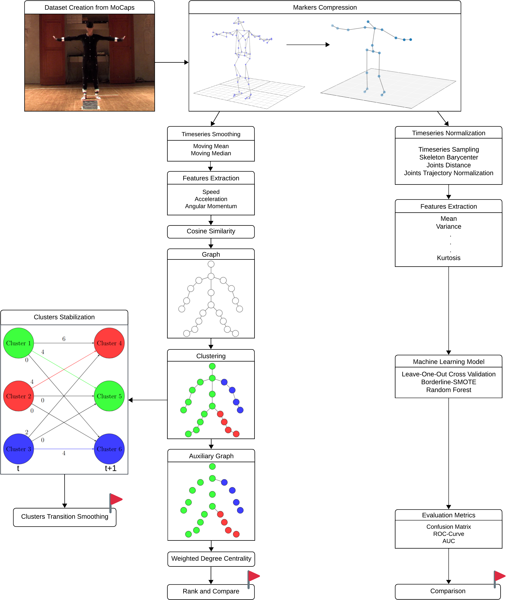

# Master's Thesis Project - Origin of Movement

Welcome to the repository for my master's thesis project: 

"A comparative analysis across algorithmic, machine learning, and visual paradigms for the automatic detection of the perceived origin of full-body human movement"

The comparison pipeline develops along two parallel tracks of quantitative comparison and one qualitative.

Starting from complete markersets with different numbers of markers (not provided due to dataset confidentiality policy), compression was performed by aggregating based on body part membership into a baseline of 20 markers.

At that point, two different approaches to recognizing the origin of movement can be tested: one based on graphs and Spectral Clustering (considered "algorithmic" for simplicity, as it is hand-tuned and not learned from data), and one based on Random Forest (considered "machine learning" as, excluding hyperparameter tuning and pipeline tuning, the system is designed to learn its internal parameters from the data).



For this thesis, we set three objectives: achieving classification for the two non-visual pipelines, and improving the visual one through inter-frame cluster smoothing.

----------------------------

This project is organized into the following folders:

## code

The `code` folder contains all the Python code used in this thesis. This code is organized into different sections or modules, each dedicated to specific tasks related to the research. In this folder, you'll also find the `requirements.txt` file, which lists all the libraries and their respective versions used in the project. To set up the required environment, you can use the following command:

```bash
pip install -r code/src/requirements.txt
```

## docs

The docs folder contains the LaTeX documents related to the thesis. This includes the main thesis document, as well as any supplementary documents, figures, and tables. The LaTeX format is used to structure and format the content, making it easier to create a professional thesis document.

## literature

The literature folder holds all the literature and references used for the thesis. It includes academic papers, books, research articles, and any other sources that have been referenced or consulted during the research.

# Co-Authors

Martina Fausto 

Gabriele Romano 

# Acknowledgments
Thanks to Sydney ChatGPT for it's "Dai Dai, Dai", "Portiamo a casa la giornata!", and "Poco Italiano" help.